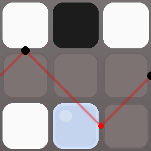
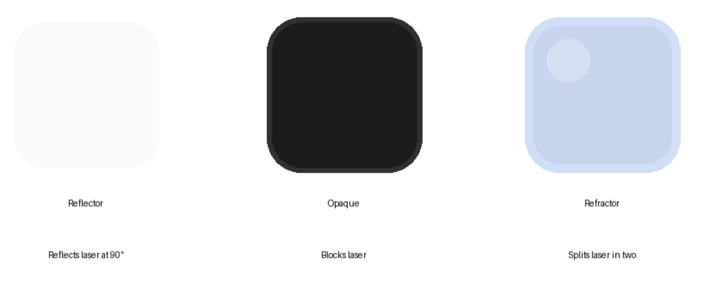
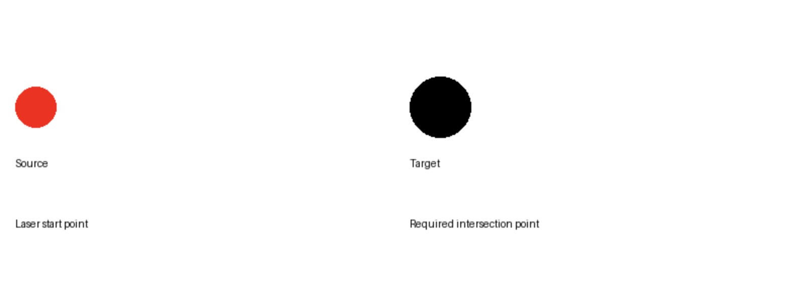

Lazor Project
============
* A Python-based automated solver for the Lazor puzzle game, designed to find block placements that guide lasers through specified target points.

* Course: EN.540.635 Software Carpentry
* Team name: YeP
* Members: Peijia Ye, Yue Liu

.. contents:: Table of Contents
   :depth: 3
   :local:

Game Overview
------------
Lazor is a puzzle game where the goal is to guide laser beams through specific points on a grid by strategically placing different types of blocks. The solver automatically finds valid solutions for given puzzle configurations.

Game Elements
~~~~~~~~~~~~

**Blocks:**

* **Reflect Block (A)**: Reflects laser beams at a 90-degree angle
* **Opaque Block (B)**: Blocks laser beams completely, stopping their path
* **Refract Block (C)**: Splits laser beams into two - one continues straight, another reflects

**Grid Positions:**

* **Available Positions (o)**: Grid points where blocks can be placed
* **Forbidden Positions (x)**: Grid points where no blocks are allowed
* **Fixed Block Positions (A, B, or C)**: Grid points with pre-placed blocks that cannot be moved, following the same properties as their movable counterparts.

**Laser Properties:**

* Start from specified positions with defined directions
* Move in straight lines when unobstructed
* Interact with blocks based on their types

**Goal:**

The puzzle is solved when the laser beam(s) pass through all specified **target points** on the grid, using the given number of each type of block.

Code Structure & Mechanism
------------------------

The solver is organized into three main classes:

1. Class Input
~~~~~~~~~~~~~
* Reads and processes ``.bff`` files
* Extracts grid configuration, block requirements, laser positions, and target points
* Validates input data and handles errors
* Returns structured data for solver

2. Class Lazor_Solution
~~~~~~~~~~~~~~~~~~~~~~
* Core solving mechanism:
   * Generates all possible block combinations
   * Simulates laser paths for each configuration
   * Tracks laser reflections, refractions, and intersections
   * Validates solutions against target points
* Stores successful solution and laser paths

3. Class SaveSolution
~~~~~~~~~~~~~~~~~~~
* Creates visual representation of solution
* Features:
   * 3D-styled blocks with shadows and highlights
   * Glowing laser paths
   * Target point indicators
   * Generates high-quality PNG output

Solving Process
~~~~~~~~~~~~~
1. Input processing: Read and validate ``.bff`` file
2. Solution finding: Test block combinations until valid solution found
3. Visualization: Generate PNG showing solution with laser paths

Input Format
-----------

The solver reads ``.bff`` (Board File Format) files with these components:

1. **Grid**
   * Enclosed between ``GRID START`` and ``GRID STOP``
   * ``o``: Available position
   * ``x``: Forbidden position
   * ``A/B/C``: Fixed reflect/opaque/refract blocks

2. **Block Requirements**
   * ``[Block Type] [Quantity]``
   * Types: A (reflect), B (opaque), C (refract)

3. **Laser Configuration**
   * ``L [x] [y] [vx] [vy]``
   * (x,y): position, (vx,vy): direction

4. **Target Points**
   * ``P [x] [y]``
   * Coordinates where laser must intersect

Example .bff File (tiny_5.bff)
~~~~~~~~~~~~~~~~~~~~~~~~~~~~~
::

    GRID START
    o B o
    o o o
    o o o
    GRID STOP
    A 3
    C 1
    L 4 5 -1 -1
    P 1 2
    P 6 3

Usage
-----

1. Place your ``.bff`` files in the same directory as the code
2. Add your puzzle files to the ``filenames`` list in ``lazer_final.py``:

   .. code-block:: python

       filenames = ["tiny_5.bff"]

3. Run the solver:

   .. code-block:: bash

       python lazer_final.py

Output:
* 1. Generates PNG files showing solution layout and laser paths, named after its input file (e.g., ``tiny_5.png``)
* 2. Execution time displayed for each puzzle

Output and Performance
--------------------

Generated PNG image example
~~~~~~~~~~~~~~~~~~~~~~~~~

*Sample solution for tiny_5.bff showing blocks and laser paths*

Legend
~~~~~~

*Different types of blocks in the solution:*

* Reflect blocks (A): White
* Opaque blocks (B): Black
* Refract blocks (C): Blue-gray with highlight

*Different types of points in the solution:*

* Laser source: Red with glow effect
* Target points: Black points

Performance
~~~~~~~~~~
Execution times for sample puzzles by macbook pro M1::

    yarn_5.bff:         1.70s
    tiny_5.bff:         0.01s
    showstopper_4.bff:  0.01s
    numbered_6.bff:     0.09s
    mad_1.bff:          0.02s
    mad_7.bff:          0.93s
    mad_4.bff:          0.11s
    dark_1.bff:         0.01s

* Average solve time: ~0.36s
* Most puzzles solved under 0.1s
* Largest puzzle (yarn_5) solved in 1.70s
